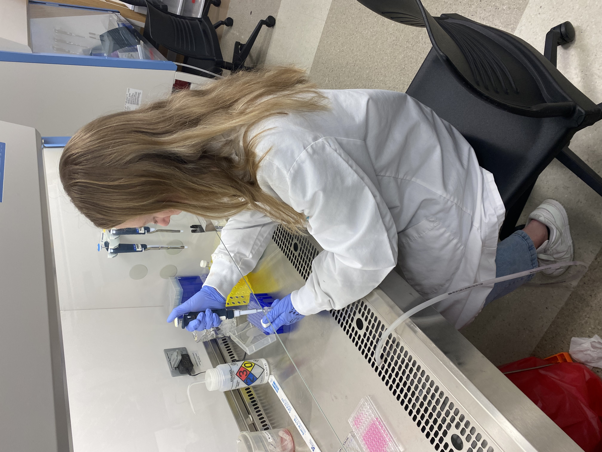
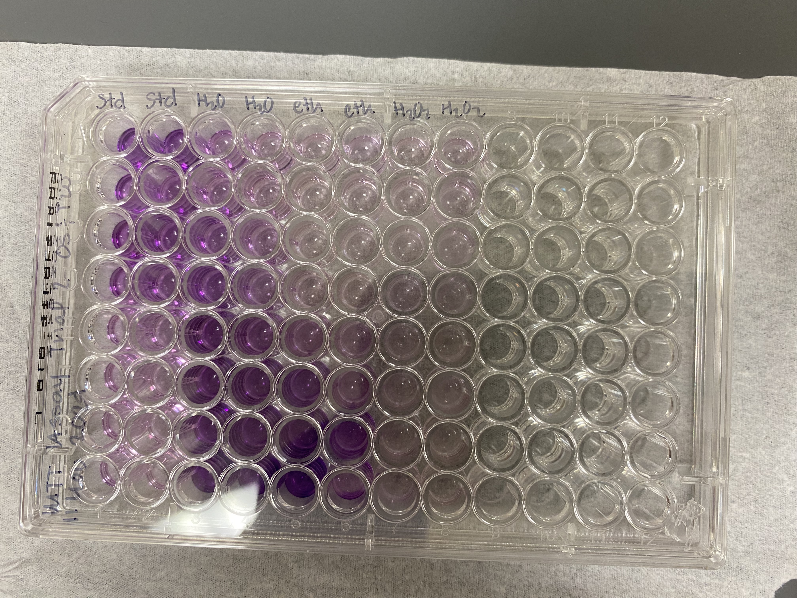

```{r}
# Set chunk options to hide warnings, messages, and errors
knitr::opts_chunk$set(
  warning = FALSE,
  message = FALSE,
  error = FALSE,   # <- This hides error messages too
  include = TRUE
)
```


```{r  out.width="20%", fig.align="center"}

```


```{r}
library(tidyverse)
library(dplyr)
library(stringr)
library(easystats)
library(equatiomatic)
library(pander)
library(broom)
library(kableExtra)
library(rmdformats)
library(prettydoc)
library(hrbrthemes)
library(tint)
library(tufte)
library(flexdashboard)


dat <- read.csv("plate_reading_2.csv")

```

# Introduction
We will look at an MTT assay performed on COS-7 cells, which are cancerous monkey kidney cells, using different sterilization reagents. 
The chemicals used were water, ethanol, and hydrogen peroxide. 
Water was used to ensure that it wasn't only the diluting of media that was causing cell death. Diluting media with water causes cells to not have as much nutrients so there is some expected cell death. Ethanol and Hydrogen peroxide are often used in the lab setting as sterilizing reagents, so we were curious to see what the effect on eukaryotic cells are. The standard which are the two first wells are to create a standard curve of "cell death" to compare the results to because the cell numbers within the ethanol and hydrogen peroxide all had 12,000 cells to see what the affect of the reagents were. 
So let's take a look at the data! 
  

```{r}
print(dat)
```


Looking at this data it is a little messy so we need to clean it up in order to properly perform any type of analysis on it! So what are the steps of cleaning data, well here they are!!
  
  Cleaning data steps: 
  
1. Import 
2. Clean
3. Visualize
4. Model
5. Report 

We have already imported our data, so let's go ahead and clean it!


# Cleaning data

```{r}
library(tidyverse)
library(broom)
library(dplyr)

dat <- read.csv("plate_reading_2.csv")
names(dat)


dat_1 <- dat %>%
  pivot_longer(cols = starts_with("cell_count"),
               names_to = "measurement",
               values_to = "cell_count")

dat_1 <- dat %>% 
  rename_with(~ sub("//.//d+$", "", .x)) %>%
  pivot_longer(cols = c("Cell_count", "Cell_count.1", "Cell_count.2", 
                        "Cell_count.3", "Cell_count.4", "Cell_count.5", 
                        "Cell_count.6", "Cell_count.7"), 
               names_to = "Measurement", 
               values_to = "cell_count")

dat_2 <- dat_1 %>% 
  rename_with(~ sub("//.//d+$", "", .x)) %>%
  pivot_longer(cols = c("standard", "standard.1", "water", "water.1", 
                        "ethanol", "ethanol.1", "hydrogen_peroxide", 
                        "hydrogen_peroxide.1"), 
               names_to = "reagent", 
               values_to = "absorbance")

dat_3 <- dat_2 %>% 
  pivot_longer(cols = c("Concentration", "Concentration.1", 
                        "Concentration.2", "Concentration.3", 
                        "Concentration.4", "Concentration.5"), 
               names_to = "concentration.1", 
               values_to = "concentration")

dat_cleaned <- dat_3 %>% 
  select("Well", 
         "cell_count", 
         "reagent", 
         "absorbance", 
         "concentration")

```


Now let us look at the data in a table and put them into models.
# Cleaned Data

<details>
  <summary>Click to expand the cleaned data table</summary>

```{r, echo=FALSE}
library(DT)
datatable(dat_cleaned, options = list(pageLength = 5, scrollX = TRUE))

```
# Model Summary and Diagnostics

```{r}
# Fit models
mod1 <- lm(concentration ~ absorbance, data = dat_cleaned)
mod2 <- lm(concentration ~ concentration * absorbance, data = dat_cleaned)
mod3 <- lm(cell_count ~ absorbance, data = dat_cleaned)

# Display summaries
summary(mod1)
```

After looking at these models let us compare them 

# Prediction Plot
```{r}
library(ggplot2)
library(performance)

compare_performance(mod1, mod2, mod3) %>% plot()

preds <- predict(mod1)
actual <- model.frame(mod1)[[1]]

ggplot(data.frame(actual = actual, predicted = preds),
       aes(x = actual, y = predicted)) +
  geom_point(alpha = 0.6) +
  geom_abline(slope = 1, intercept = 0, linetype = "dashed", color = "red") +
  theme_minimal() +
  labs(title = "Actual vs Predicted", x = "Actual", y = "Predicted")

```

# Visualize 

```{r}
dat_cleaned %>% 
  ggplot(aes(x = concentration, 
             y = absorbance, 
             color = reagent)) + 
  geom_point() +
  facet_wrap(~reagent)
```
Here is a visible picture of the results 
```{r echo=FALSE,  out.width="20%", fig.align="center"}

```


# Conclusion
Looking at the image, there is a nice gradient of purple where the less of a reagent was used, the darker it was, which means that there are more cells present here because the mitochondria is converting formazan crystals to get that purple color. So as a visible cue the reagents kill off these cells.
Looking at these graphs we can see that hydrogen peroxide will kill anything it touches. 
The surprising thing is that ethanol and water follow the same trend of cell amounts. This could be because the ethanol wasn't concentrated enough, but we can contribute some of the cell death to the DMSO. 
The modeling dashboard provides insight into how absorbance relates to both concentration and cell count, with model comparisons guiding which has better predictive power.

Possible points of error could have been as we learned with our previous run to use parafilm to ensure that the ethanol isn’t going to evaporate off. Understanding that hydrogen peroxide is so strong, even at such low concentrations it killed off most cells so figuring out what we could do for another run. 
If we were to run this experiment again, we would dilute the hydrogen peroxide even more to get it so dilute to where cells are able to survive. Rerunning this experiment would be a great idea for the purpose of reproducing results to ensure that we just didn’t get a one time number rather our results would become more reliable. Maybe adding another reagent, or running with different reagents over all. Seeing the effects of the caffeine for example on kidney cells or how some vitamins affect kidney cells. Maybe using a different cell line to see what the difference is in monkey kidney cells versus say a rabbit or a rat’s kidney cells. 

  


