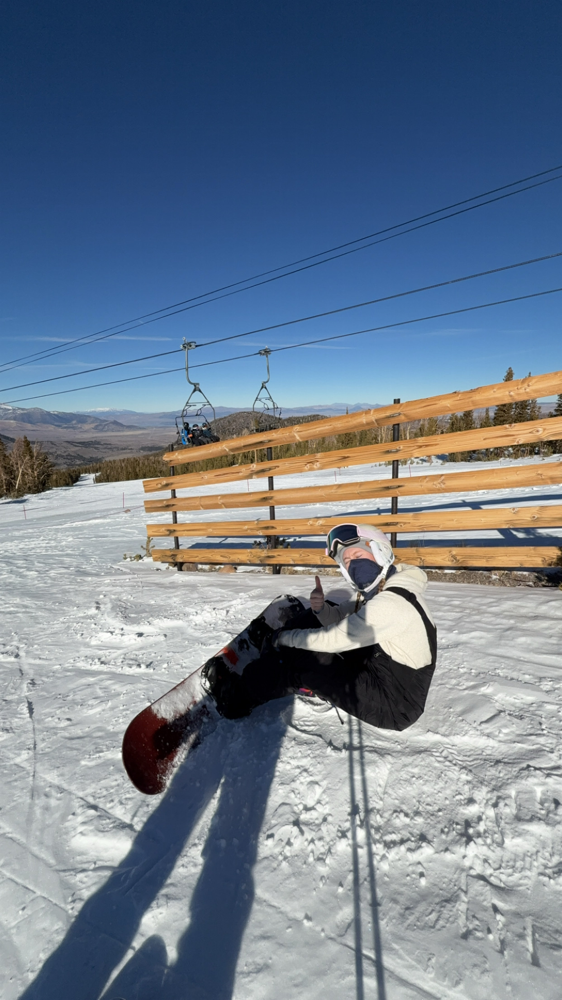

```{r echo=FALSE,  out.width="40%", fig.align="left"}

knitr::include_graphics("JGG07854.JPG")

```
```{r echo=FALSE, out.width="40%", fig.align='right'}

```


```{r setup, include=FALSE}
knitr::opts_chunk$set(echo = TRUE)
```

Hello! I am Taylor Wooten! 
I am currently a student at UVU studying biotechnology and chemistry. I am currently working as a quality assistant at a microbiology lab, learning and earning my ASQ certification. I am petrifilm certified. 
I played D1 softball for two years at UVU before deciding to fully focus on my education and my career. 
Here you will find links to pages! 


[Final_Project](https://twoot04.github.io/final_project/) |
[Resume](https://docs.google.com/document/d/1Gn5QXjH9H9g3b53DqMk9Wa1VjATlBXxOJ6Dd50zXAmQ/edit?usp=sharing)

You can reach me at: 
email: wootentaylor04@gmail.com 
work: taylorw@yourqualitylab.com


```{r echo=FALSE,  out.width="50%", fig.align="center"}

knitr::include_graphics("IMG_7989.PNG")
